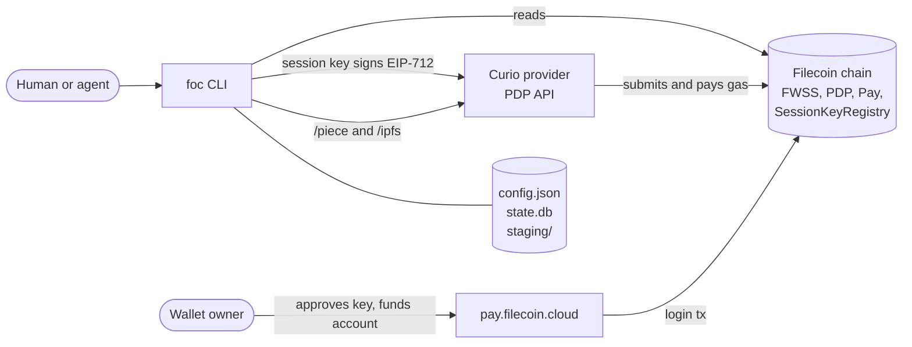
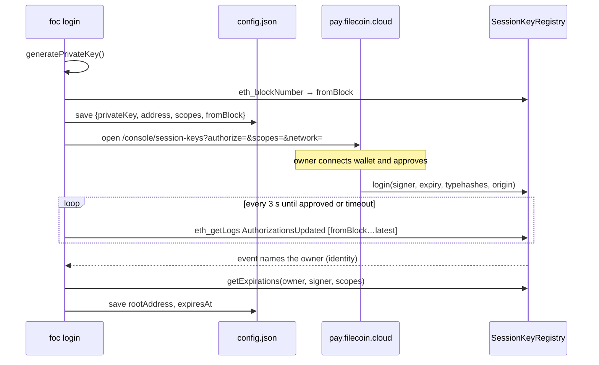
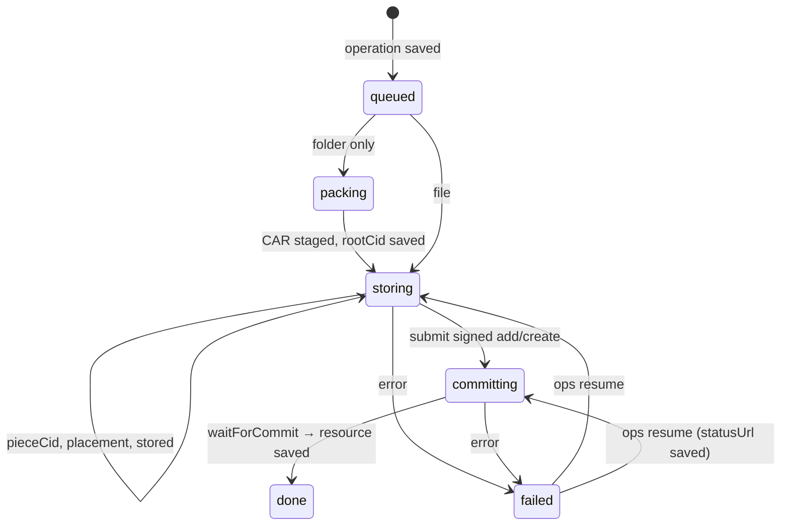

# foc CLI architecture

This document describes how the `foc` prototype in [`packages/foc-cli`](../packages/foc-cli) works: its modules, the login, put, get, and rm flows, local state, and the recovery model. The [interface research](foc-cli-interface-research.md) explains why the design looks like this. This document describes what was built and where it departs from that design.

## Overview

`foc` stores one file or folder on Filecoin Onchain Cloud (FOC) and returns Curio retrieval URLs.

- **One command for files and folders.** `foc put <path>` stores a file as a raw piece. It packs a folder into a UnixFS CAR.
- **One copy.** Each upload has one copy on one provider. The CLI calls [synapse-core](https://github.com/FilOzone/synapse-sdk/tree/master/packages/synapse-core) directly and does not use synapse-sdk.
- **Delegated signing.** A session key, approved by the wallet owner in the [pay.filecoin.cloud console](https://pay.filecoin.cloud/console/session-keys), signs uploads and removals. The owner's wallet pays for storage.
- **Recoverable jobs.** Each `put` and `rm` is saved as an operation in SQLite before it changes anything outside the machine, so an interrupted job can be resumed.
- **Machine contract.** [incur](https://github.com/wevm/incur) provides `--json`, `--schema`, `--llms`, and `--mcp`, calls to action, and structured errors with exit classes.



The CLI never sends a chain transaction itself. Curio submits the data set and piece transactions, and the owner's wallet submits the session-key approval from the console. The CLI signs typed data and reads chain state.

## Modules

```text
packages/foc-cli/src/
├── index.ts            bin entry; serves the incur CLI
├── cli.ts              command tree, option schemas, calls to action
├── app.ts              per-invocation context: network, chain, clients, config, lazy DB
├── config.ts           iso-conf store and network resolution
├── errors.ts           FocError, exit classes, guard() → incur error results
├── auth/
│   ├── scopes.ts       console scope IDs ↔ FWSS permission typehashes
│   ├── login.ts        console URLs, on-chain approval discovery and polling
│   ├── session.ts      credentials from env or config; permission check before mutations
│   └── open-browser.ts best-effort browser opener
├── commands/
│   ├── auth.ts         login, logout, status
│   └── storage.ts      put, get, ls, inspect, rm, ops *
├── storage/
│   ├── types.ts        StorageBackend interface (the seam tests fake)
│   ├── synapse.ts      StorageBackend built on synapse-core
│   ├── jobs.ts         put/rm orchestration, checkpoints, resume
│   ├── pack.ts         folder → UnixFS CAR, CAR → folder
│   ├── get.ts          streaming verified download, artifact extraction
│   └── urls.ts         Curio /piece and /ipfs URLs
└── state/
    ├── db.ts           node:sqlite, migrations, transactions
    ├── resources.ts    managed files and artifacts
    ├── operations.ts   jobs, checkpoints, execution lock
    └── ids.ts          res_… and op_… identifiers
```

The code has three layers:

1. **`cli.ts`** declares commands and schemas. It builds an `App` and calls a command function inside `guard()`.
2. **`commands/`** resolves the session and account scope, then calls into storage or auth.
3. **`storage/` and `state/`** hold the logic. `jobs.ts` depends only on the `StorageBackend` interface, so tests replace the provider and chain with a fake.

`App` (`app.ts`) is created once per command. It opens the database only when first used, so read-only commands and `--help` never touch disk state.

## Configuration

[iso-conf](https://github.com/hugomrdias/iso-repo/tree/main/packages/iso-conf) stores `config.json` in the platform config directory (`foc`), or in `FOC_CONFIG_DIR`, with mode `0600`.

```jsonc
{
  "network": "calibration",
  "sessions": {
    "calibration": {
      "privateKey": "0x…",        // session key, never printed
      "address": "0x…",           // session key address
      "rootAddress": "0x…",       // owner; absent while approval is pending
      "scopes": ["createDataSet", "addPieces", "schedulePieceRemovals"],
      "fromBlock": "4112865",     // block when the key was created
      "expiresAt": "1793304656",  // earliest granted scope expiry
      "createdAt": "…"
    }
  }
}
```

**Network resolution:** `--network`, then `FOC_NETWORK`, then the config file, then `calibration`. Each network has its own session.

**Credential resolution:** `FOC_SESSION_KEY` with `FOC_ROOT_ADDRESS`, then the saved session. A pending session is reported as `LOGIN_PENDING`, not as logged out.

Other overrides: `FOC_STATE_DIR`, `FOC_RPC_URL`, `FOC_CONSOLE_URL`.

## Login

The goal is one command with nothing to copy or paste. Filecoin Pin asks the user to copy a wallet address and a session key into environment variables, and needs the root private key to create a key. `foc` does neither.



Details (`auth/login.ts`, `commands/auth.ts`):

- **The key is saved first.** Running `foc login` again resumes a pending login with the same key and scopes. A fully approved session that already covers the requested scopes is reused. Anything else, or `--fresh`, generates a new key.
- **Finding the owner.** In `AuthorizationsUpdated`, `identity` (the owner) is indexed but `signer` is not. The CLI therefore scans events from `fromBlock` in windows of at most 2,000 blocks and matches the signer locally. The matching event names the owner, so the user never enters an address.
- **Partial grants.** The console lets the owner untick scopes. After finding the owner, the CLI reads per-scope expiries and reports `granted` and `missing`. A result with no granted scope is `SCOPES_DENIED`.
- **Terminal vs. agent.** In a terminal, login opens the browser and waits (default 600 s). When run by an agent or through a pipe, it checks once and returns `LOGIN_PENDING` (exit 7) with the URL. The agent can pass the URL to a human and run `foc login` again later.
- **Console link contract.** The address is lowercased, because the console rejects bad mixed-case checksums. The scopes use console IDs. The network is required. The funding link is `/console?deposit=<decimal>&operator=fwss&network=<net>` and is added only when a deposit is needed.
- **Funding stays with the owner.** The session key cannot deposit or approve. `foc status` and the `put` preflight return a prefilled funding link.

Default scopes are `createDataSet`, `addPieces`, and `schedulePieceRemovals`. `terminateService` is never requested by default.

Before each mutation, `requireSession` rebuilds the key with `fromSecp256k1` and syncs its expiries from the registry. synapse-core's signing helpers do not check permissions, so this check is the only thing that turns an expired or missing scope into `SESSION_EXPIRED` (exit 3) instead of a contract revert.

## Storage: put

`put` routes by input type:

| Input | Stored bytes | Data set metadata | Piece metadata | URL |
| --- | --- | --- | --- | --- |
| File | exact file bytes | `source=foc` | `name` | `<serviceURL>/piece/<pieceCid>` |
| Folder | UnixFS CAR | `source=foc`, `withIPFSIndexing` | `name`, `ipfsRootCID` | `<serviceURL>/ipfs/<rootCid>/` |

Files and folders use separate data sets because data sets are matched on their exact metadata keys, and only CARs should be IPFS-indexed.

### Phases and checkpoints



`storage/jobs.ts` saves each result to the operation checkpoint before the next step depends on it:

1. **Pack (folders only).** Write `staging/<op>/artifact.car`, then save `rootCid`.
2. **Identify.** Stream the bytes through `Piece.calculate` and save `pieceCid` and `size`. Enforce the PDP limits of 127 B to 1,065,353,216 B.
3. **Place.** Save `providerId`, `serviceURL`, `payee`, and an existing `dataSetId`/`clientDataSetId` if one matches.
   - `--provider` selects the provider directly.
   - Otherwise the CLI calls `fetchProviderSelectionInput` then `selectProviders({count: 1})`, which prefers an existing data set with matching metadata.
   - Each candidate is checked with `SP.ping`; unreachable ones are excluded and selection runs again.
   - `getUploadCosts` then acts as a funding preflight. If the account is short, the result is `FUNDING_REQUIRED` with a console link.
4. **Upload.** Call `SP.findPiece` first. If the provider does not already have the piece, call `SP.uploadPieceStreaming` from a file stream, then `findPiece({poll: true})` until the piece is parked. Save `stored`.
5. **Commit.** For an existing data set, call `SP.addPieces`. Otherwise call `SP.createDataSetAndAddPieces` with `payee = provider.payee` and `payer = rootAddress`. The session key signs, and Curio submits and pays gas. Save `statusUrl` and `transactionHash` **before waiting**.
6. **Confirm.** Call `waitForCreateDataSetAddPieces` or `waitForAddPieces`, which return `dataSetId` and `pieceId`. Save the resource and complete the operation in one SQLite transaction, then delete staging.

Two synapse-core details matter here:

- **`payer`** must be passed as the root address. Otherwise the signed payload uses the session key's address as the payer.
- **`payee`** must be `provider.payee`, because FWSS checks the signature against the registry payee. synapse-sdk passes `serviceProvider`, which only works when the two addresses are the same.

### Resume

`runOperation` acquires the operation lock and runs the job from its checkpoint. Any failure marks the operation `failed` and records the error. `foc ops resume <id>` then applies these rules:

- **Commit already submitted** (`statusUrl` saved): it only waits on that status and never signs or submits again.
- **Piece already uploaded** (`stored` set, or found on the provider): it skips the upload and goes to commit.
- **Source changed:** the PieceCID is recomputed from the source (files) or the staged CAR (folders). A mismatch fails with `SOURCE_CHANGED`; the job does not silently store different bytes.
- **Staged CAR missing** after its identity was saved: fails with `STAGING_MISSING`.

The lock is a compare-and-swap `UPDATE` on `(execution_status, pid)`. A `running` operation whose process is gone (`process.kill(pid, 0)` fails) is treated as interrupted and can be taken over. One held by a live process returns `OPERATION_LOCKED`.

## Storage: get

`get <ref|pieceCid>` always downloads the stored piece from `/piece/<pieceCid>`. That is the only form whose bytes can be checked against the PieceCID.

- **Files.** The response is streamed through `Piece.hasher()` into `<output>.foc-partial`. The file is renamed to its final name only if the computed PieceCID matches. synapse-core's `downloadAndValidate` would buffer the whole piece in memory.
- **Folders.** The CLI downloads and verifies the CAR the same way, then opens it with `CarIndexedReader`. It checks that the header root equals the saved `rootCid`, walks the DAG with `ipfs-unixfs-exporter`, and extracts into a temporary directory that is renamed into place. Entry names containing path separators, or resolving outside the output directory, are rejected.
- **Unmanaged PieceCIDs.** The CLI finds a provider with `resolvePieceUrl`, then downloads and verifies the piece the same way.

Folders are packed with `ipfs-unixfs-importer` using the IPIP-499 `unixfs-v1-2025` profile (CIDv1, raw leaves, 1 MiB chunks), the same profile Filecoin Pin uses. Entries are walked in sorted order, dotfiles are skipped, and symlinks are rejected, so packing the same folder twice gives the same root CID. Parent directories are derived from file paths; only empty directories are passed to the importer explicitly, because an explicit parent makes the importer emit an unreferenced empty-directory block. Blocks stream to disk under a placeholder root, then the CAR header is updated with the real root.

Extraction checks every block's bytes against its CID, as `ipfs-car unpack --verify` does. A CAR downloaded from `/piece` is already covered by the PieceCID check, but a CAR rebuilt by a gateway (such as Curio `/ipfs/…?format=car`) can only be trusted block by block.

### Comparison with ipfs-car

[ipfs-car](https://github.com/storacha/ipfs-car) 3.1.0 uses `@ipld/unixfs` with raw leaves, 1 MiB chunks, and width 1024, and switches to a sharded directory at more than 1,000 entries. The two packers were compared on 2026-09-29:

| Input | foc | ipfs-car |
| --- | --- | --- |
| 480 MB single file in a folder | 0.6 s; CAR byte-identical to ipfs-car | 0.8 s |
| Nested folders of small files, no shard | Same root CID | Same root CID |
| Flat folder of 3,000 files | Different root CID | Different root CID |

The difference for large directories is expected. `unixfs-v1-2025` shards by encoded block size (the rule Kubo and Boxo use for this profile), and ipfs-car shards by entry count. `foc` keeps the IPIP-499 profile so its CIDs match other implementations of that profile. The comparison did find the orphan-block issue above, and it suggested block verification on extraction.

## Storage: rm

`rm <ref>` creates an operation with the copy as its target, then:

1. calls `SP.schedulePieceDeletions` after reading `clientDataSetId` from the data set,
2. saves the transaction hash,
3. waits for the receipt,
4. marks the resource `removal_pending`.

The provider removes the piece at a later proving boundary. `ls` hides resources pending removal unless `--all` is passed.

## Local state

```text
<FOC_STATE_DIR or platform data dir>/
├── state.db           SQLite (node:sqlite), WAL, migrations via PRAGMA user_version
└── staging/<op_id>/   artifact.car for unfinished folder puts
```

| Table | Key | Contents |
| --- | --- | --- |
| `resources` | `ref` | kind, name, chain ID, payer, PieceCID, root CID, size, `copies` (JSON: providerId, dataSetId, pieceId, serviceURL), URL, status |
| `operations` | `id` | action, resource ref, chain ID, payer, execution status, phase, `input` (JSON), `checkpoint` (JSON), pid, error, timestamps |

All queries are limited to `(chainId, payer)`, so one database can serve several networks and accounts. Neither table holds file bytes or keys.

## Output and errors

Commands return plain JSON-safe objects; on-chain IDs and amounts are decimal strings. incur renders them as TOON, JSON, YAML, or Markdown and adds calls to action. Progress messages go to stderr, and only in a terminal.

Errors are `FocError`s with a stable `code`, an exit class, a `retryable` flag, and optional next commands. `guard()` converts them into incur error results. Any other error surfaces as `UNKNOWN` (exit 1).

| Exit | Class | Examples |
| --- | --- | --- |
| 2 | invalid input | `INVALID_INPUT`, `INVALID_SIZE`, `SOURCE_CHANGED`, `OUTPUT_EXISTS` |
| 3 | action required | `NOT_LOGGED_IN`, `SESSION_EXPIRED`, `FUNDING_REQUIRED`, `SCOPES_DENIED` |
| 4 | not found | `NOT_FOUND`, `PROVIDER_NOT_FOUND` |
| 5 | transient | `OPERATION_FAILED`, `RETRIEVAL_FAILED`, `OPERATION_LOCKED`, `NO_PROVIDER` |
| 7 | pending | `LOGIN_PENDING` |

## Testing

Tests use the Node test runner (`pnpm check`) and need no network:

| Test | Covers |
| --- | --- |
| `state.test.ts` | migrations, queries scoped by account, checkpoint merging, the lock against a live child process |
| `login.test.ts` | console URL contract, scope classification, the windowed event scan against a fake viem transport |
| `pack.test.ts` | deterministic root CID, byte-exact extraction, no orphan blocks, empty directories, tampered-block rejection, dotfile and symlink rules |
| `jobs.test.ts` | puts to a new and an existing data set, resume without resubmission, skipping an upload the provider already has, source-change detection, rm (all through a fake `StorageBackend`) |
| `cli.test.ts` | exit codes and error codes through `cli.serve`, the `publish` alias |

### Verified on calibration (2026-09-29)

- `login`: approved through the production console in about 1m40s. All three scopes were found on chain with no copying.
- `put ./docs`: provider 9 (`calib.ezpdpz.net`), new data set 39723, piece 0, in about 1m20s.
- `get`: the PieceCID matched, and the extracted tree is byte-identical to the source.
- `/ipfs/<rootCid>/` answered HTTP 200 seconds after the commit. Curio returns CARs by default and raw blocks for the root. A raw request for a nested path returned 400.

## Differences from the research design

| Research | Prototype | Reason |
| --- | --- | --- |
| `foc files …` and `foc artifacts …` groups | Flat `put/get/ls/inspect/rm` routed by input type; `publish` alias | One command set for files and folders |
| Two copies by default | One copy | Prototype scope |
| Exact file bytes staged as `input.bin` | Files read from the source; a PieceCID check on resume detects changes | Avoids copying large inputs; a change fails instead of storing different bytes |
| `operations …` group | `ops …` group | Shorter |
| `--events`, `--dry-run`, `--input`, cursor pagination | Not implemented | Deferred |
| Verified browser URL | Curio `/ipfs/` URL, which serves CARs | Curio does not render content; a gateway is still needed |
| Keys in credential storage | Session key in `config.json` (mode 0600) | No keychain integration yet |

## Known limits

- Content outside 127 B to about 1 GiB is rejected. Tiny files could be routed through IPFS later.
- A put that fails before any external mutation, such as `FUNDING_REQUIRED`, stays listed as an incomplete operation.
- `inspect --check` probes only the root URL, not each file in the folder.
- `logout` deletes the local key but does not revoke it on chain; revoke it in the console.
- A pending login that is resumed much later scans every block since `fromBlock`. `--fresh` starts over.
