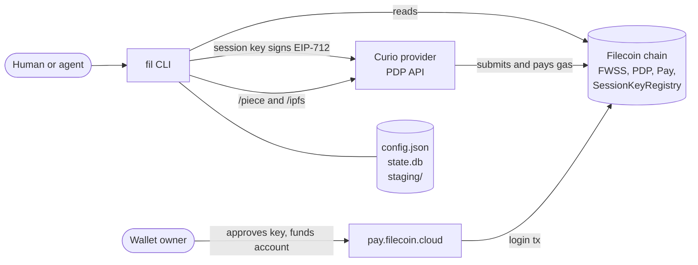
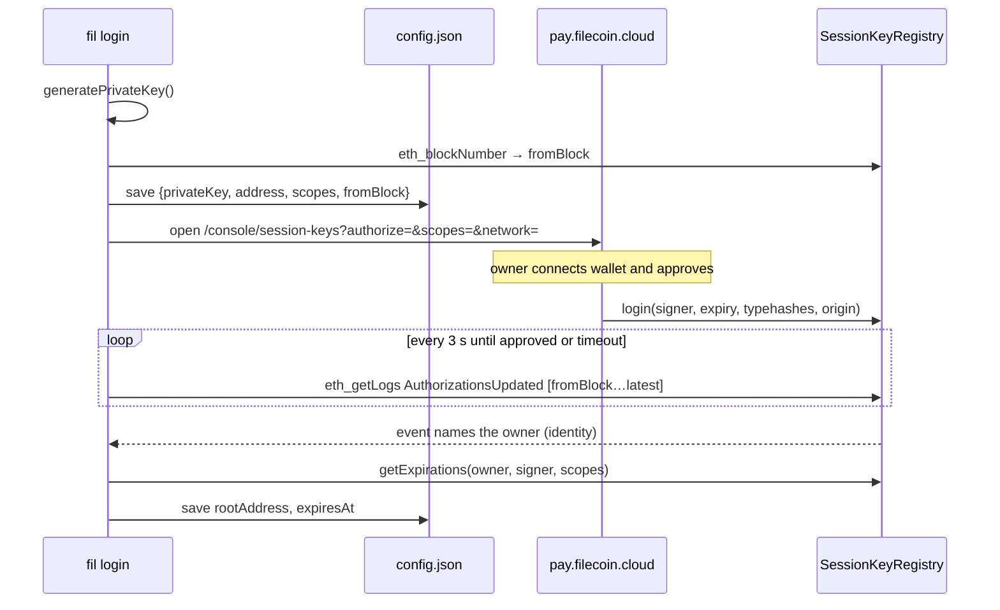
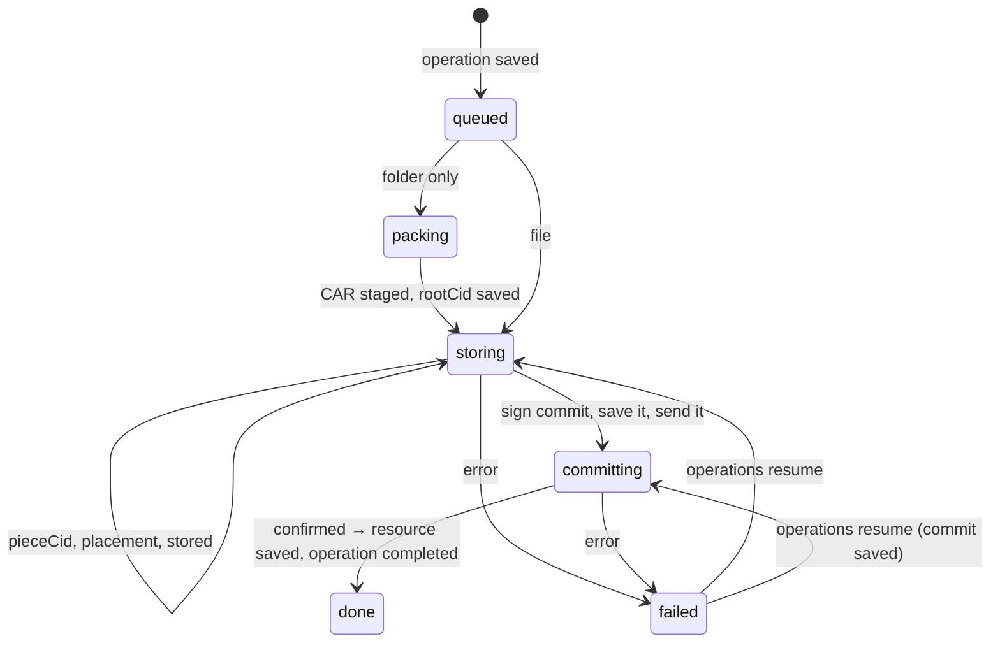

# fil CLI architecture

This document describes how the `fil` prototype in [`packages/fil-cli`](../../packages/fil-cli) works: its modules, the login, put, get, and delete flows, local state, and the recovery model. The [interface research](interface-research.md) explains why the design looks like this. This document describes what was built and where it departs from that design.

## Overview

`fil` stores one file or folder on Filecoin Onchain Cloud (FOC) and returns Curio retrieval URLs.

- **One command for files and folders.** `fil put <path>` stores a file as a raw piece. It packs a folder into a UnixFS CAR.
- **One copy.** Each upload has one copy on one provider. The CLI calls [synapse-core](https://github.com/FilOzone/synapse-sdk/tree/master/packages/synapse-core) directly and does not use synapse-sdk.
- **Delegated signing.** A session key, approved by the wallet owner in the [pay.filecoin.cloud console](https://pay.filecoin.cloud/console/session-keys), signs uploads and removals. The owner's wallet pays for storage.
- **Recoverable jobs.** Each `put` and `delete` is saved as an operation in SQLite before it changes anything outside the machine, so an interrupted job can be resumed without committing twice.
- **Machine contract.** [clipact](../../packages/clipact/README.md) implements the [CLI guidelines for agents](../agent-cli/guidelines.md): one JSON result on stdout, exit codes `0`/`1`, errors with `retryable` and `next` steps marked `by: "agent"` or `by: "user"`, offline `schema`, confirmation gates, signal handling, and lazily loaded handlers.



The CLI never sends a chain transaction itself. Curio submits the data set and piece transactions, and the owner's wallet submits the session-key approval from the console. The CLI signs typed data and reads chain state.

## Modules

```text
packages/fil-cli/
├── bin/fil.js            entry shim: enables the compile cache, imports dist/main.js
├── scripts/build.ts      esbuild bundle: one entry, one chunk per handler
├── skills/fil/SKILL.md   agent skill installed by `fil skills install`
└── src/
    ├── main.ts           cli.run()
    ├── cli.ts            defineCli: name, version, commands, aliases, skills, mapError
    ├── commands/         one definition per command; imports only zod and clipact
    │   ├── shared.ts     account input fragment, paging, output schemas
    │   ├── login.ts  logout.ts  status.ts  doctor.ts
    │   ├── put.ts  get.ts  ls.ts  inspect.ts  delete.ts
    │   ├── operations/   ls.ts  inspect.ts  resume.ts
    │   └── index.ts      the command tree and the operations group
    ├── handlers/         one handler per command, loaded only when it runs
    │   ├── context.ts    appFor(ctx), account scope, jobContext, lookups
    │   └── …             same layout as commands/
    ├── map-error.ts      viem and synapse-core errors → service_unavailable, timeout
    ├── network.ts        network names, free of imports
    ├── app.ts            per-invocation context: network, chain, signal-bound clients, config, lazy DB
    ├── config.ts         iso-conf store and network resolution
    ├── errors.ts         error codes, operationError(), abortable()
    ├── usdfc.ts          USDFC amount formatting
    ├── auth/
    │   ├── scope-ids.ts  console scope IDs, free of imports
    │   ├── scopes.ts     scope IDs ↔ FWSS permission typehashes
    │   ├── login.ts      console URLs, on-chain approval discovery and polling
    │   ├── session.ts    credentials from input or config; permission check before mutations
    │   └── open-browser.ts
    ├── storage/
    │   ├── types.ts      StorageBackend interface (the seam tests fake)
    │   ├── synapse.ts    StorageBackend built on synapse-core
    │   ├── jobs.ts       put/delete orchestration, signed commits, resume, dry-run estimate
    │   ├── pack.ts       folder → UnixFS CAR, CAR → folder
    │   ├── get.ts        streaming verified download, artifact extraction
    │   └── urls.ts       Curio /piece and /ipfs URLs
    └── state/
        ├── db.ts         node:sqlite, migrations, transactions
        ├── resources.ts  managed files and artifacts, paged
        ├── operations.ts jobs, checkpoints, execution lock, paged
        ├── cursor.ts     opaque keyset cursors
        └── ids.ts        res_… and op_… identifiers
```

The code has three layers:

1. **`commands/`** declares each command once: its input schema (flags, positionals, environment fallbacks, secrets), output schema, error codes, and side effects (`readOnly`, `idempotent`, `confirm`, `dryRun`). clipact derives parsing, validation, help, `schema`, and completions from it. These modules import only zod, clipact, and the import-free `network.ts` and `auth/scope-ids.ts`, so `--help`, `--version`, and `schema` never load synapse-core or viem.
2. **`handlers/`** resolve the session and account scope through plain functions (`appFor`, `jobContext`), then call into storage or auth. clipact has no middleware; shared setup is a function each handler calls.
3. **`storage/`, `state/`, and `auth/`** hold the logic. `jobs.ts` depends only on the `StorageBackend` interface, so tests replace the provider and chain with a fake.

`App` (`app.ts`) is created once per command from its account input. It opens the database only when first used, so `status` and `logout` never touch disk state.

Startup on Node 26 (median of 20 runs after 5 warmups, warm compile cache, bare `node -e ''` at 56 ms): `--version` 70 ms, `--help` 71 ms, `schema put` 73 ms, and `ls`, which loads its handler with viem and synapse-core, 98 ms. The incur build took about 410 ms for `--version`, because every command imported synapse-core and viem eagerly.

## Configuration

[iso-conf](https://github.com/hugomrdias/iso-repo/tree/main/packages/iso-conf) stores `config.json` in the platform config directory (`fil`), or in `FIL_CONFIG_DIR`, with mode `0600`.

```jsonc
{
  "network": "calibration",
  "sessions": {
    "calibration": {
      "privateKey": "0x…",        // session key, never printed
      "address": "0x…",           // session key address
      "rootAddress": "0x…",       // owner; absent while approval is pending
      "scopes": ["createDataSet", "addPieces", "schedulePieceRemovals"],
      "fromBlock": "4112865",     // block when the key was created
      "expiresAt": "1793304656",  // earliest granted scope expiry
      "createdAt": "…"
    }
  }
}
```

**Network resolution:** `--network`, then `FIL_NETWORK`, then the config file, then `calibration`. clipact has no global flags, so `network` is a field of every command's input (the `account` fragment in `commands/shared.ts`), with `FIL_NETWORK` as its environment fallback and no schema default, so the config file still applies. Each network has its own session.

**Credential resolution:** `FIL_SESSION_KEY` with `FIL_ROOT_ADDRESS`, then the saved session. Both are input fields too; `sessionKey` is a clipact secret, read only from the environment, rejected as a flag, and redacted in `--debug` and `schema`. A pending session is reported as `login_pending`, not as logged out.

Other overrides are process settings rather than command input: `FIL_CONFIG_DIR`, `FIL_STATE_DIR`, `FIL_RPC_URL`, `FIL_CONSOLE_URL`. `fil doctor` shows each resolved value and its source.

## Login

The goal is one command with nothing to copy or paste. Filecoin Pin asks the user to copy a wallet address and a session key into environment variables, and needs the root private key to create a key. `fil` does neither.



Details (`auth/login.ts`, `handlers/login.ts`):

- **The key is saved first.** Running `fil login` again resumes a pending login with the same key and scopes. A fully approved session that already covers the requested scopes is reused. Anything else, or `--fresh`, generates a new key.
- **Finding the owner.** In `AuthorizationsUpdated`, `identity` (the owner) is indexed but `signer` is not. The CLI therefore scans events from `fromBlock` in windows of at most 2,000 blocks and matches the signer locally. The matching event names the owner, so the user never enters an address.
- **Partial grants.** The console lets the owner untick scopes. After finding the owner, the CLI reads per-scope expiries. If any requested scope is missing, the session is still saved and the result is `permission_denied`, with the missing scopes in `error.details` and a `by: "user"` step to log in again.
- **Human vs. agent.** When a human is at a terminal (clipact's `mode.interactive` and no detected agent), login opens the browser and waits (default 600 s; `ctx.signal` stops the wait). Otherwise it checks once and returns `login_pending` with two `next` steps: the approval link `by: "user"`, and `fil login` `by: "agent"` to check again. It never opens a browser for an agent.
- **Console link contract.** The address is lowercased, because the console rejects bad mixed-case checksums. The scopes use console IDs. The network is required. The funding link is `/console?deposit=<decimal>&operator=fwss&network=<net>` and is added only when a deposit is needed.
- **Funding stays with the owner.** The session key cannot deposit or approve. `fil status` and the `put` preflight return a prefilled funding link.

Default scopes are `createDataSet`, `addPieces`, and `schedulePieceRemovals`. `terminateService` is never requested by default.

Before each mutation, `requireSession` rebuilds the key with `fromSecp256k1` and syncs its expiries from the registry. synapse-core's signing helpers do not check permissions, so this check is the only thing that turns an expired or missing scope into `session_expired` (with a `by: "user"` step) instead of a contract revert.

## Storage: put

`put` routes by input type:

| Input | Stored bytes | Data set metadata | Piece metadata | URL |
| --- | --- | --- | --- | --- |
| File | exact file bytes | `source=fil` | `name` | `<serviceURL>/piece/<pieceCid>` |
| Folder | UnixFS CAR | `source=fil`, `withIPFSIndexing` | `name`, `ipfsRootCID` | `<serviceURL>/ipfs/<rootCid>/` |

Files and folders use separate data sets because data sets are matched on their exact metadata keys, and only CARs should be IPFS-indexed.

### Phases and checkpoints



`storage/jobs.ts` saves each result to the operation checkpoint before the next step depends on it:

1. **Pack (folders only).** Write `staging/<op>/artifact.car`, then save `rootCid`.
2. **Identify.** Stream the bytes through `Piece.calculate` and save `pieceCid` and `size`. Enforce the PDP limits of 127 B to 1,065,353,216 B.
3. **Place.** Save `providerId`, `serviceURL`, `payee`, and an existing `dataSetId`/`clientDataSetId` if one matches.
   - `--provider` selects the provider directly.
   - Otherwise the CLI calls `fetchProviderSelectionInput` then `selectProviders({count: 1})`, which prefers an existing data set with matching metadata.
   - Each candidate is checked with `SP.ping`; unreachable ones are excluded and selection runs again.
   - `getUploadCosts` then acts as a funding preflight. If the account is short, the result is `insufficient_funds` with the console link as a `by: "user"` step.
4. **Upload.** Call `SP.findPiece` first. If the provider does not already have the piece, call `SP.uploadPieceStreaming` from a file stream, then `findPiece({poll: true})` until the piece is parked. Save `stored`.
5. **Sign.** Choose a random add-pieces `nonce` (and a `clientDataSetId` for a new data set), sign the payload with `signAddPieces` or `signCreateDataSetAndAddPieces` (`payee = provider.payee`, `payer = rootAddress`), and save the signed `extraData` and nonce **before sending**.
6. **Send.** Pass the saved `extraData` to `SP.addPieces` or `SP.createDataSetAndAddPieces`. Curio submits and pays gas. Save `statusUrl` and `transactionHash`.
7. **Confirm.** Call `waitForCreateDataSetAddPieces` or `waitForAddPieces`, which return `dataSetId` and `pieceId`. Save the resource and mark the operation completed in one SQLite transaction, then delete staging on a best-effort basis.

Two synapse-core details matter here:

- **`payer`** must be passed as the root address. Otherwise the signed payload uses the session key's address as the payer.
- **`payee`** must be `provider.payee`, because FWSS checks the signature against the registry payee. synapse-sdk passes `serviceProvider`, which only works when the two addresses are the same.

### Resume

`runOperation` returns the saved outcome of a completed operation without running anything. Otherwise it acquires the operation lock, reports the operation to clipact with `ctx.checkpoint` (which prints its ID to stderr immediately, so it survives a SIGKILL), and runs the job from its checkpoint. A failure marks the operation `failed` and becomes an error with a `fil operations resume <id>` step. Errors with a fil code also carry `operationId` in `error.details`, and built-in codes such as `invalid_input` keep their own `details`. Put and delete errors are never `retryable`, because repeating the original command starts a new paid operation. `fil operations resume <id>` then applies these rules:

- **Commit signed** (`commit` saved): first read `clientNonces(payer, nonce)` from the FWSS view contract. FWSS stores `((firstAdded + count) << 128) | dataSetId` for every used add-pieces nonce, including the add half of create-and-add, so a non-zero value means the commit landed and gives both IDs; the job completes without sending anything. A zero value means it did not land, and the **same** `extraData` is sent again (or awaited, if its `statusUrl` was saved). FWSS rejects a second use of a nonce, so at most one commit takes effect even if the first submission lands late ([#1](https://github.com/hugomrdias/foc-cli/issues/1)).
- **Commit rejected** (the provider reports a failed transaction): the saved `statusUrl` is cleared, so a resume checks the nonce and resends the same signature.
- **Piece already uploaded** (`stored` set, or found on the provider): it skips the upload and goes to commit.
- **Source changed:** the PieceCID is recomputed from the source (files) or the staged CAR (folders). A mismatch fails with `source_changed`; the job does not silently store different bytes.
- **Staged CAR missing** after its identity was saved: fails with `staging_missing`.

The lock is a compare-and-swap `UPDATE` on `(execution_status, pid)`. A `running` operation whose process is gone (`process.kill(pid, 0)` fails) is treated as interrupted and can be taken over. One held by a live process returns `operation_running`. Locks held by this process are also tracked in memory, so a second call in the same process is refused, while a `running` row left with a reused PID is taken over ([#3](https://github.com/hugomrdias/foc-cli/issues/3)).

Completion is saved in the same transaction as the resource, so a stop after the commit leaves a completed operation, never one that looks unfinished but cannot resume ([#4](https://github.com/hugomrdias/foc-cli/issues/4)).

### Dry run

`put --dry-run` stores nothing and signs nothing. It inventories the input, packs a folder into a temporary directory to measure the CAR, and, when a session key is available, selects the provider and prices the upload with `getUploadCosts`. The result reports `authorization` (`ready`, `login_required`, `login_pending`, or `scopes_missing`), the provider and existing data set, the monthly rate, lockup, and any deposit needed, with a timestamp.

### Cancellation

clipact aborts `ctx.signal` on the first SIGINT, SIGTERM, or SIGHUP. Handlers pass it to `createApp`, which binds it to the RPC transport: every chain read made through synapse-core or viem rejects as soon as the signal aborts, and no request starts after it. The request itself is not cancelled, because viem's HTTP transport would use the signal in place of its own timeout. The synapse backend passes `app.signal` to uploads, downloads, and piece polling, races provider calls that take no signal (commit submission and waits, removal, ping) against it with `abortable()`, and never sends a commit or removal after an abort, so the handler returns promptly. The job records the operation as failed with `Interrupted`, and clipact writes an `interrupted` result with the resume step from the checkpoint, then re-raises the signal (`130` or `143`).

## Storage: get

`get <ref|pieceCid>` always downloads the stored piece from `/piece/<pieceCid>`. That is the only form whose bytes can be checked against the PieceCID.

- **Files.** The response is streamed through `Piece.hasher()` into `<output>.fil-partial`. The file is renamed to its final name only if the computed PieceCID matches. synapse-core's `downloadAndValidate` would buffer the whole piece in memory.
- **Folders.** The CLI downloads and verifies the CAR the same way, then opens it with `CarIndexedReader`. It checks that the header root equals the saved `rootCid`, walks the DAG with `ipfs-unixfs-exporter`, and extracts into a temporary directory that is renamed into place. Entry names containing path separators, or resolving outside the output directory, are rejected.
- **Unmanaged PieceCIDs.** The CLI finds a provider with `resolvePieceUrl`, then downloads and verifies the piece the same way.

Folders are packed with `ipfs-unixfs-importer` using the IPIP-499 `unixfs-v1-2025` profile (CIDv1, raw leaves, 1 MiB chunks), the same profile Filecoin Pin uses. Entries are walked in sorted order, dotfiles are skipped, and symlinks are rejected, so packing the same folder twice gives the same root CID. Parent directories are derived from file paths; only empty directories are passed to the importer explicitly, because an explicit parent makes the importer emit an unreferenced empty-directory block. Blocks stream to disk under a placeholder root, then the CAR header is updated with the real root.

Extraction reads each file in 8 MiB windows. `ipfs-unixfs-exporter` queues a file's blocks without waiting for the consumer, so a single `content()` call over a local CAR would buffer the whole file (about 1 GB of RSS for a 1 GB file, against 83 MB with windows).

Extraction checks every block's bytes against its CID, as `ipfs-car unpack --verify` does. A CAR downloaded from `/piece` is already covered by the PieceCID check, but a CAR rebuilt by a gateway (such as Curio `/ipfs/…?format=car`) can only be trusted block by block.

### Comparison with ipfs-car

[ipfs-car](https://github.com/storacha/ipfs-car) 3.1.0 uses `@ipld/unixfs` with raw leaves, 1 MiB chunks, and width 1024, and switches to a sharded directory at more than 1,000 entries. The two packers were compared on 2026-09-29:

| Input | fil | ipfs-car |
| --- | --- | --- |
| 480 MB single file in a folder | 0.6 s; CAR byte-identical to ipfs-car | 0.8 s |
| Nested folders of small files, no shard | Same root CID | Same root CID |
| Flat folder of 3,000 files | Different root CID | Different root CID |

The difference for large directories is expected. `unixfs-v1-2025` shards by encoded block size (the rule Kubo and Boxo use for this profile), and ipfs-car shards by entry count. `fil` keeps the IPIP-499 profile so its CIDs match other implementations of that profile. The comparison did find the orphan-block issue above, and it suggested block verification on extraction.

## Storage: delete

`delete <ref>` (alias `rm`) needs confirmation: a human at a terminal is asked, and everyone else, agents included, gets `confirmation_required` until they pass `--yes`. It creates an operation with the copy as its target, then:

1. calls `SP.schedulePieceDeletions` after reading `clientDataSetId` from the data set,
2. saves the transaction hash,
3. waits for the receipt and checks its status,
4. marks the resource `removal_pending` and completes the operation in one transaction.

A reverted transaction leaves the resource `active`, clears the saved hash so a resume signs a new removal, and fails with `removal_reverted` ([#2](https://github.com/hugomrdias/foc-cli/issues/2)).

The provider removes the piece at a later proving boundary. `ls` hides resources pending removal unless `--all` is passed.

## Local state

```text
<FIL_STATE_DIR or platform data dir>/
├── state.db           SQLite (node:sqlite), WAL, migrations via PRAGMA user_version
└── staging/<op_id>/   artifact.car for unfinished folder puts
```

| Table | Key | Contents |
| --- | --- | --- |
| `resources` | `ref` | kind, name, chain ID, payer, PieceCID, root CID, size, `copies` (JSON: providerId, dataSetId, pieceId, serviceURL), URL, status |
| `operations` | `id` | action, resource ref, chain ID, payer, execution status, phase, `input` (JSON), `checkpoint` (JSON), pid, error, timestamps |

All queries are limited to `(chainId, payer)`, so one database can serve several networks and accounts. Neither table holds file bytes or keys.

## Output and errors

clipact renders results. In machine mode (`--json`, `FIL_OUTPUT=json`, a detected agent, or a non-terminal stdout) stdout carries one compact JSON object; otherwise each command's `human()` formatter writes text. On-chain IDs and amounts are decimal strings. Progress goes to stderr: a status line for humans, a plain line at most every 15 s for agents. The object has `data` on success or `error` on failure, then optional `next` steps; exit code `0` means the result has `data`, and `1` means it has `error`.

Errors are clipact `CliError`s with a stable snake_case `code`, a `retryable` flag, optional `details`, and `next` steps. Each command lists its codes in its definition, and `schema` and help show them. Errors from viem or synapse-core that are not `CliError`s go through the lazily loaded `map-error.ts`, which maps RPC and HTTP failures to `service_unavailable` or `timeout`; clipact marks those retryable only for read-only and idempotent commands. Anything else is `internal_error`.

| Code | Next step | Raised by |
| --- | --- | --- |
| `auth_required`, `login_pending`, `session_expired`, `permission_denied` | user: log in or approve | session checks, login |
| `insufficient_funds` | user: fund at the console link | put preflight |
| `not_found`, `output_exists` | agent: list resources or operations; choose another path | lookups, get |
| `operation_failed`, `commit_rejected`, `removal_reverted`, `source_changed`, `staging_missing`, `operation_running` | agent: resume or inspect the operation | put, delete, resume |
| `verification_failed`, `unsafe_path` | none | get |
| `invalid_input`, `confirmation_required`, `interrupted`, `internal_error`, `service_unavailable`, `timeout` | clipact built-ins | |

## Testing

Tests use the Node test runner (`pnpm check`) and need no network:

| Test | Covers |
| --- | --- |
| `state.test.ts` | migrations (including `rm` → `delete`), account-scoped queries, cursor paging, checkpoint merging, the lock against a live child process, a second caller in the same process, and a reused PID |
| `login.test.ts` | console URL contract, scope classification, the windowed event scan against a fake viem transport |
| `pack.test.ts` | deterministic root CID, byte-exact extraction, no orphan blocks, empty directories, tampered-block rejection, dotfile and symlink rules |
| `jobs.test.ts` | a fake `StorageBackend` that simulates FWSS nonces: new and existing data sets, a lost commit response, a commit that never landed, a rejected commit, resuming a completed job, insufficient funds, a reverted removal, interruption, dry-run estimates, and operation IDs and resume steps on every job error |
| `cli.test.ts` | the whole CLI in process through `clipact/testing` in strict mode: definitions, schemas and aliases, auth and pending-login errors, confirmation, dry-run without a session, secrets kept out of flags and output |
| `contract.test.ts` | the built binary without a TTY: one JSON line on stdout, exit codes, no leaked session key, and SIGTERM during a hanging RPC call giving an `interrupted` result and exit 143 |

### Verified on calibration (2026-09-29)

- `login`: approved through the production console in about 1m40s. All three scopes were found on chain with no copying.
- `put ./docs`: provider 9 (`calib.ezpdpz.net`), new data set 39723, piece 0, in about 1m20s.
- `get`: the PieceCID matched, and the extracted tree is byte-identical to the source.
- `/ipfs/<rootCid>/` answered HTTP 200 seconds after the commit. Curio returns CARs by default and raw blocks for the root. A raw request for a nested path returned 400.

## Differences from the research design

| Research | Prototype | Reason |
| --- | --- | --- |
| `fil files …` and `fil artifacts …` groups | Flat `put/get/ls/inspect/delete` routed by input type; `publish` and `rm` aliases | One command set for files and folders |
| `auth login`, `auth status` | `login`, `logout`, `status` | Flat, like the storage commands |
| Two copies by default | One copy | Prototype scope |
| Exact file bytes staged as `input.bin` | Files read from the source; a PieceCID check on resume detects changes | Avoids copying large inputs; a change fails instead of storing different bytes |
| `operations inspect --refresh` | Not implemented | Resume already reconciles with the chain before sending |
| `--events`, `--fields` | Not implemented | Deferred, as in clipact |
| `deleted` and `partial` removal states | `removal_pending` once the removal transaction succeeds | The provider removes the piece later; nothing observes it yet |
| Verified browser URL | Curio `/ipfs/` URL, which serves CARs | Curio does not render content; a gateway is still needed |
| Keys in credential storage | Session key in `config.json` (mode 0600) | No keychain integration yet |

## Known limits

- Content outside 127 B to about 1 GiB is rejected. Tiny files could be routed through IPFS later.
- A put that fails before any external mutation, such as `insufficient_funds`, stays listed as an incomplete operation.
- `inspect --check` probes only the root URL, not each file in the folder.
- `logout` deletes the local key but does not revoke it on chain; revoke it in the console.
- A pending login that is resumed much later scans every block since `fromBlock`. `--fresh` starts over.
