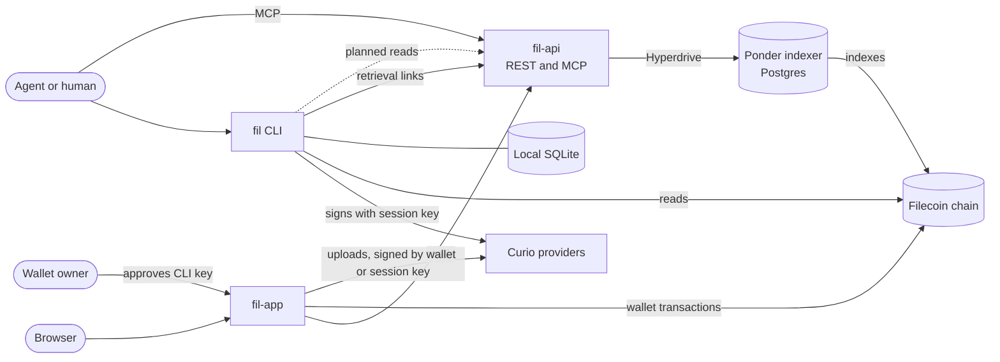

# fil

`fil` began as a proof of concept for a [Filecoin](https://docs.filecoin.cloud/) command-line interface built for agents. It now has four parts: a CLI, a REST API, an MCP server, and a web app. This page is the entry point to the proof of concept. It summarizes the four parts and records the assumptions, compromises, open questions, and follow-up work.

## What the project includes

The table lists the four parts, the agent skill that comes with the CLI, and the planned agent plugins and website.

| Part | What it does | Code | Where it runs |
| --- | --- | --- | --- |
| CLI | `fil` stores a file or folder as one copy on one Curio provider and returns retrieval URLs. It resumes an interrupted put or delete without paying twice. | [`packages/fil-cli`](../../packages/fil-cli/README.md) | Locally, after a build from source |
| Agent skill | Teaches an agent to use `fil` | [`skills/fil/SKILL.md`](../../packages/fil-cli/skills/fil/SKILL.md) | In the agent, after `fil skills install`. Also served at https://fil-app.hugomrdias.dev/.well-known/agent-skills/index.json |
| REST API | Serves read-only data on providers, data sets, pieces, Filecoin Pay rails, and session keys. `/get/{cid}` redirects to where a CID can be retrieved. | [`apps/fil-api`](../../apps/fil-api/README.md) | https://fil-api.hugomrdias.dev, with a reference at [`/docs`](https://fil-api.hugomrdias.dev/docs) |
| MCP server | Offers one read-only tool for each REST API data route, over stateless Streamable HTTP | [`apps/fil-api/src/mcp`](../../apps/fil-api/src/mcp/server.ts) | `POST https://fil-api.hugomrdias.dev/mcp` |
| Web app | Shows the REST API's data in an explorer, which a Worker renders on the server. Its wallet dashboard manages Filecoin Pay, the Warm Storage approval, data sets, uploads, rails, and session keys. Its setup page approves `fil login` keys and funding requests. Browser agents can fill it and read the account, data sets, pieces, and session keys through WebMCP. | [`apps/fil-app`](../../apps/fil-app/README.md) | https://fil-app.hugomrdias.dev |
| Agent plugins | Bundle the CLI, the agent skill, and the MCP server for Claude and ChatGPT | Not started | Planned |
| Website | The landing page, the docs, and the agent setup page. Every page also has a Markdown version, and `llms.txt`, a sitemap, and well-known paths describe the API, the MCP server, and the skill to agents | [`apps/fil-app`](../../apps/fil-app/README.md#website) | https://fil-app.hugomrdias.dev |

## How the parts connect

All parts use the same chain and the same providers, but each part keeps its own state:

- **The CLI does not read from fil-api yet.** It reads the chain through synapse-core. It keeps its resources and operations in a local SQLite database. Its retrieval links point to fil-api's `/get/{cid}` route, which redirects to a provider or to inbrowser.link.
- **The app reads through fil-api.** It writes with the connected wallet or with a session key made in the dashboard. The app stores those session keys in the browser's `localStorage`.
- **`fil login` sends the owner to fil-app.** The CLI keeps its session key on the machine and sends only the key's address, name, scopes, and expiry in a [setup link](../../apps/fil-app/README.md#setup-links). The owner reviews the prefilled page and signs the approval with their wallet. `fil status` and `put` send funding requests to the same page.

## Related documents

| Document | Contents |
| --- | --- |
| [fil architecture](architecture.md) | How the CLI works: modules, login, put, get, delete, local state, recovery, and how the CLI differs from the research |
| [fil interface research](interface-research.md) | The historical design research from 2026-09-28 that came before the CLI. The [differences table](architecture.md#differences-from-the-research-design) lists where the CLI differs from it. |
| [fil-api README](../../apps/fil-api/README.md) | Routes, retrieval redirects, MCP tools, deploys, and limits |
| [fil-app README](../../apps/fil-app/README.md) | The explorer, the dashboard, the stack, and deploys |
| [hooks-synapse README](../../apps/fil-app/src/hooks-synapse/README.md) | React hooks that synapse-react lacks, and the synapse-core and synapse-react bugs found while writing them |

## Assumptions behind the proof of concept

- **We test with our own app and website.** For testing, the CLI uses fil-app instead of pay.filecoin.cloud. For the same reason, the planned website takes the place of filecoin.cloud and filecoin.io. The results of this prototype will inform improvements to pay.filecoin.cloud, filecoin.cloud, and filecoin.io.
- **Two kinds of user.** An agent runs `fil` in a shell or calls the MCP server. A human owns the wallet, approves the agent's session key, and funds the account. The agent never holds the wallet key.
- **Claude and ChatGPT first.** Plugins for Claude and ChatGPT will be the main way to add `fil` to an agent. Other agents get a manual fallback. The user runs `fil skills install` to copy the skill into `.agents/skills` and `.claude/skills`. The user can also add the MCP server URL to the agent's settings.
- **A session key is enough for storage.** A key with the `createDataSet`, `addPieces`, and `schedulePieceRemovals` scopes can store and delete data. Only the owner can deposit, approve operators, or terminate service.
- **synapse-core is enough.** The CLI and the app call synapse-core directly. Neither uses synapse-sdk.
- **Content fits in one piece.** A file, or the CAR of a folder, must be between 127 and 1,065,353,216 bytes.
- **Browsers render files from Curio and folders through a gateway.** Curio's `/piece` endpoint serves a file inline with a detected content type, so a browser renders it. Its `/ipfs` endpoint returns only blocks and CARs, so browser links to folders go to [inbrowser.link](https://inbrowser.link), a public gateway that runs in a service worker.
- **fil-api serves most reads.** The CLI will read most data from fil-api. It will fall back to chain reads through synapse-core only where fil-api cannot serve a read. Today the CLI reads all chain data through synapse-core.
- **The indexer runs outside this repository.** fil-api reads the `early-repair` and `foc-observer` schemas of a Ponder Postgres database. It never writes to the database. The databases run in Helsinki, and fil-api runs in Frankfurt, next to Hyperdrive's connection pool ([placement](../../apps/fil-api/README.md#placement)).
- **Calibration first.** The CLI defaults to calibration. Every part also supports mainnet, but the only recorded end-to-end run of the CLI was on calibration, on 2026-09-29.

## Compromises in the proof of concept

### CLI

- **Flat commands.** The research proposed separate `files` and `artifacts` groups. Instead, `put`, `get`, `ls`, `inspect`, and `delete` handle both and pick the handling from the input.
- **Plain-text session key.** `fil` stores the key in `config.json` with mode `0600`, not in an OS keychain.
- **`logout` leaves the key valid on chain.** It deletes the key on this machine but does not revoke it.
- **Local view only.** `fil ls` lists only the resources in this machine's state database. It cannot see content stored from another machine or from the app.
- **Piece removal stops at `removal_pending`.** Nothing tracks when the provider removes the piece.
- **Slow hashing.** PieceCID hashing takes about 70 seconds per GiB. `put`, `operations resume`, and `get` each hash the whole content ([#6](https://github.com/hugomrdias/fil/issues/6)).
- **Shallow folder check.** `inspect --check` probes only the piece URL, not each file of a folder.
- **Links wait for the indexer.** The piece link, and a file's browser link, return 404 until fil-api's indexer has the new piece. A folder's browser link names the root CID, so it works at once. `fil get` downloads from the provider directly.
- **No `--events`, `--fields`, or `operations inspect --refresh`.** The research proposed all three.

### REST API and MCP server

- **Agents cannot store data through MCP.** Neither the REST API nor the MCP server can store, delete, or sign. A remote MCP server cannot read files from the agent's machine, so uploads need a different design.
- **No authentication.** The only control is a per-IP rate limit of 120 requests a minute for the REST API and 60 for MCP.
- **Data trails the chain.** The REST API and the MCP server return what the indexer has stored so far. `/health` reports the latest indexed block.
- **Unindexed owner queries.** An `owner` filter scans every data set until the indexer adds an index ([#13](https://github.com/hugomrdias/fil/issues/13)).
- **Best-effort browser links for folders.** For a folder, `/get/{cid}?browser=true` redirects to inbrowser.link, which this project does not operate. For a file, it redirects to the provider's `/piece` URL.

### App

- **Session keys in `localStorage`.** The app scopes them by chain and wallet, but any script on the origin can read them.
- **WebMCP is an early preview.** The app's WebMCP tools work in Chrome 149 and later on fil-app.hugomrdias.dev through an origin-trial token that expires on 2027-03-30. Elsewhere they need Chromium's `#enable-webmcp-testing` flag. The ChatGPT Chrome extension finds the tools, and OpenAI documents WebMCP support, under the name site tools, in the ChatGPT desktop app's built-in browser. Other browsers ignore the tools, and agents use the setup link instead. Testing with real agents is tracked in [#34](https://github.com/hugomrdias/fil/issues/34).
- **Explorer lists load in the browser.** The server renders each page, but only detail pages, such as a rail or a data set, include their data. Lists and tables still fetch their rows after the page loads, so an agent that fetches a list page gets no rows.
- **Server rendering hides the visitor from fil-api.** When the Worker fetches from fil-api during server rendering, fil-api's per-IP rate limit counts the Worker, not the visitor.
- **Site content is a copy.** The site's pages in `apps/fil-app/src/content` are edited copies of the READMEs. Nothing keeps them in sync, so they can fall behind the code.
- **Draft discovery formats.** The MCP server card (SEP-2127) and agent skills discovery are drafts. The site serves the server card at both `/.well-known/mcp/server-card.json` and `/.well-known/mcp-server-card`, because clients check one or the other. fil-api's own origin serves none of the discovery files.
- **Upstream hooks kept in the app.** `hooks-synapse` adds hooks that synapse-react 0.5.0 lacks. It also works around the bugs listed in [its README](../../apps/fil-app/src/hooks-synapse/README.md).

### Project

- **One copy, for simplicity.** synapse-sdk stores two copies by default. The CLI and the app's upload store one copy on one provider to keep the prototype simple.
- **Personal infrastructure.** The REST API and the app deploy to a personal Cloudflare account under `hugomrdias.dev`.
- **Nothing is published.** Every package is private, so the only way to install the CLI is to build it from source.
- **No agent evaluation yet.** No one has run the [agent evaluations](../agent-cli/guidelines.md#evaluate-with-agents) in Claude or ChatGPT.

## Open questions

- What are the product name and the domain? Does the binary stay `fil`?
- With two copies, how does a put report a partial result when only one copy succeeds?
- For browser links, should we rely on inbrowser.link, run our own gateway with an origin per publication, or wait for Beam to serve IPFS content?
- Should the remote MCP server get upload and delete tools? If so, what authentication and upload transport does it use? Or should a local MCP server wrap the CLI instead?
- Should the agent skill bundle the CLI? Or should it tell users to install the CLI, or to run it with `npx @hugomrdias/fil` or `pnpm dlx @hugomrdias/fil`?
- What do we need before we recommend mainnet to agents? Candidates are spending limits and keychain storage.
- Who runs the indexer and the Cloudflare deployment, and what availability do we promise?
- Do mutable names, custom domains, private content, or content over 1 GiB belong in the first release? The research deferred all four.

## Follow-up work

- **Brand.** Apply a brand to the site once the product name and domain are decided.
- **Evaluation.** Run the [acceptance scenarios](interface-research.md#first-release-and-validation) with Claude and ChatGPT. Count duplicate paid mutations, and check that each share link works.
- **Agent files at the repository root.** Move the agent skill out of `packages/fil-cli/skills` to the repository root, and add the agent plugins there too. `fil skills install` reads the skill from the package, so the build must copy it from the root into `packages/fil-cli/skills`.
- **Explorer for agents.** Render explorer lists on the server, and serve explorer pages as Markdown, so agents can read them like the docs.
- **Agent plugins.** Build plugins for Claude and ChatGPT. Each plugin bundles the CLI, the agent skill, and the MCP server.
- **Two copies.** Store two copies by default in the CLI and the app's upload, as synapse-sdk does.
- **CLI reads.** Move most CLI reads to fil-api. Keep synapse-core chain reads as the fallback.
- **CLI performance.** Hash PieceCIDs with `@hugomrdias/commp-wasm` ([#6](https://github.com/hugomrdias/fil/issues/6)).
- **CLI keys.** Store the session key in the OS keychain. Revoke the key on chain from `logout`.
- **CLI state.** Track a removal until the provider deletes the piece. Check every file of a folder in `inspect --check`.
- **MCP servers.** Review the [foc-observer](https://github.com/FilOzone/foc-observer) MCP server. Merge its tools into the fil-api MCP server.
- **Indexer.** Index `data_sets(payer)` in the early-repair schema ([#13](https://github.com/hugomrdias/fil/issues/13)). Consider moving the databases near Frankfurt, where Hyperdrive pools their connections, to cut each query from about 30 ms to an estimated 5–10 ms ([placement](../../apps/fil-api/README.md#placement)).
- **Upstream.** Move `hooks-synapse` into synapse-react. Report the synapse-core and synapse-react bugs listed in its README.
- **Packaging.** Publish the CLI to npm as `@hugomrdias/fil`. npm is the only distribution channel for now.
