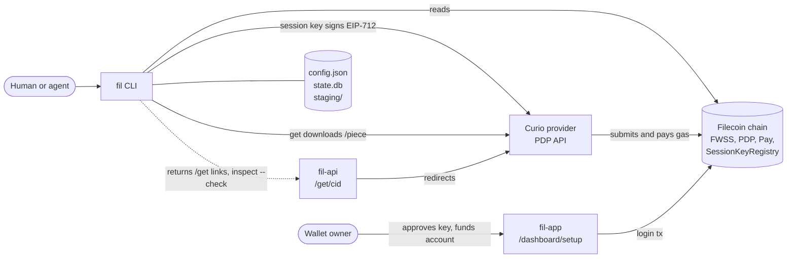
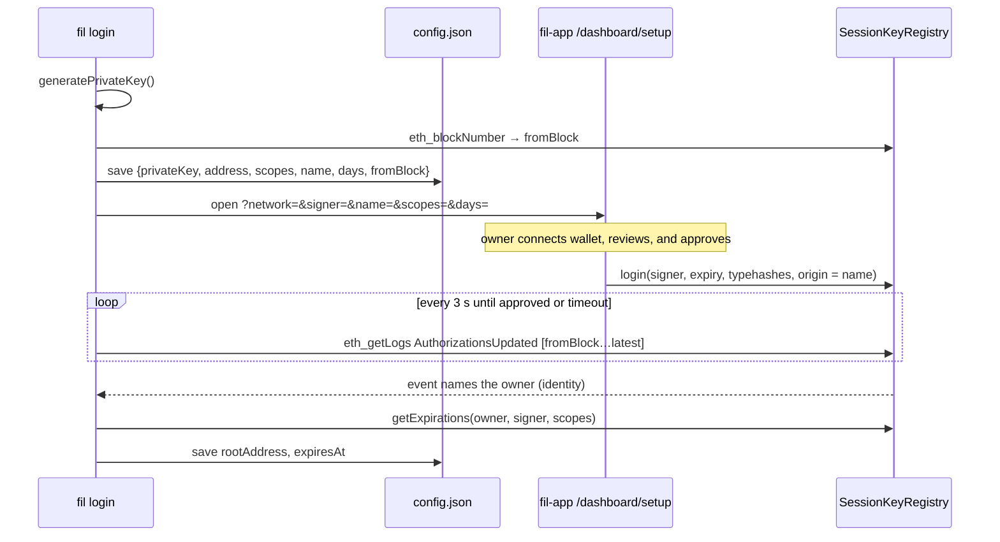
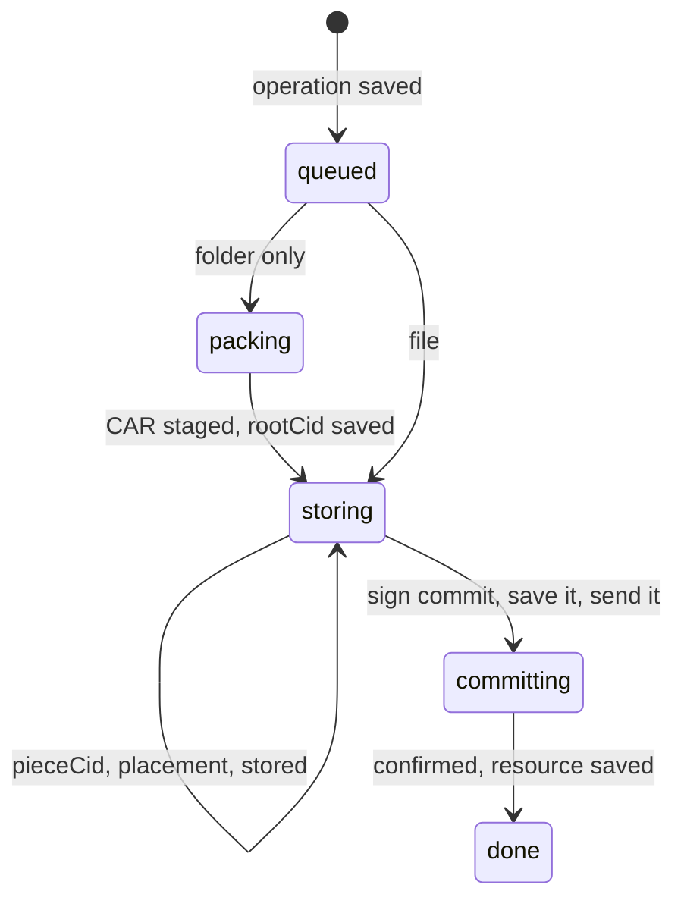

# fil CLI architecture

This document describes how the `fil` prototype in [`packages/fil-cli`](../../packages/fil-cli) works. It covers the modules, the login, put, get, and delete flows, local state, and recovery. The [interface research](interface-research.md) explains the design behind the prototype, and the [last section](#differences-from-the-research-design) lists where the prototype differs from it.

## Overview

`fil` stores one file or folder on Filecoin and returns fil-api retrieval URLs. They redirect to the provider or to a browser gateway.

- **One command for files and folders.** `fil put <path>` stores a file as a raw piece. It packs a folder into a UnixFS CAR.
- **One copy.** Each upload has one copy on one provider.
- **synapse-core only.** The CLI calls [synapse-core](https://github.com/FilOzone/synapse-sdk/tree/master/packages/synapse-core) directly and does not use synapse-sdk.
- **Delegated signing.** A session key signs uploads and removals. The wallet owner approves the key on the [fil-app setup page](../../apps/fil-app/README.md#setup-links), and the owner's wallet pays for storage.
- **Recoverable operations.** `fil` saves each `put` and `delete` as an operation in SQLite before it changes anything outside the machine. `fil operations resume` never commits an interrupted operation twice.
- **Machine contract.** [clipact](../../packages/clipact/README.md) implements the [CLI guidelines for agents](../agent-cli/guidelines.md). It gives `fil` one JSON result on stdout, exit codes `0` and `1`, and errors with `retryable` and `next` steps marked `by: "agent"` or `by: "user"`. It also provides an offline `schema` command, confirmation prompts, signal handling, and lazily loaded handlers.



The CLI never sends a chain transaction itself. It signs typed data and reads chain state. Curio submits the data set and piece transactions, and the owner's wallet submits the session key approval from fil-app.

## Modules

```text
packages/fil-cli/
├── bin/fil.js            entry shim: enables the compile cache, imports dist/main.js
├── scripts/build.ts      esbuild bundle: one entry, one chunk per handler; copies the root skills/
├── skills/               gitignored build copy of the root skills/, installed by `fil skills install`
└── src/
    ├── main.ts           cli.run()
    ├── cli.ts            defineCli: name, version, commands, aliases, skills, mapError
    ├── commands/         one definition per command; imports only zod and clipact
    │   ├── shared.ts     account input fragment, paging, output schemas
    │   ├── login.ts  logout.ts  status.ts  doctor.ts
    │   ├── put.ts  get.ts  ls.ts  inspect.ts  delete.ts
    │   ├── operations/   ls.ts  inspect.ts  resume.ts
    │   └── index.ts      the command tree and the operations group
    ├── handlers/         one handler per command, loaded only when it runs
    │   ├── context.ts    appFor(ctx), account scope, jobContext, lookups
    │   └── …             same layout as commands/
    ├── map-error.ts      viem and synapse-core errors → service_unavailable, timeout
    ├── network.ts        network names, free of imports
    ├── app.ts            per-invocation context: network, chain, signal-bound clients, config, lazy DB
    ├── config.ts         iso-conf store and network resolution
    ├── errors.ts         error codes, operationError(), abortable()
    ├── usdfc.ts          USDFC amount formatting
    ├── auth/
    │   ├── scope-ids.ts  scope IDs and the default key name, free of imports
    │   ├── scopes.ts     scope IDs ↔ FWSS permission typehashes
    │   ├── login.ts      fil-app setup links, on-chain approval discovery and polling
    │   ├── session.ts    credentials from input or config; permission check before mutations
    │   └── open-browser.ts
    ├── storage/
    │   ├── types.ts      StorageBackend interface, which tests replace with a fake
    │   ├── synapse.ts    StorageBackend built on synapse-core
    │   ├── jobs.ts       put and delete jobs, signed commits, resume, dry-run estimate
    │   ├── pack.ts       folder → UnixFS CAR, CAR → folder
    │   ├── get.ts        streaming verified download, folder extraction
    │   └── urls.ts       fil-api /get URLs, and the Curio /piece URL for get
    └── state/
        ├── db.ts         node:sqlite, migrations, transactions
        ├── resources.ts  managed files and folders, paged
        ├── operations.ts operations, checkpoints, execution lock, paged
        ├── cursor.ts     opaque keyset cursors
        └── ids.ts        res_… and op_… identifiers
```

The code has three layers:

1. **`commands/`** declares each command once. A definition holds the input schema (flags, positionals, environment fallbacks, and secrets), the output schema, the error codes, and the side effects (`readOnly`, `idempotent`, `confirm`, and `dryRun`). clipact derives parsing, validation, help, `schema`, and completions from it. These modules import only zod, clipact, `commands/shared.ts`, and three local modules that need nothing else: `errors.ts`, `network.ts`, and `auth/scope-ids.ts`. So `--help`, `--version`, and `schema` never load synapse-core or viem.
2. **`handlers/`** resolve the session and the account scope through plain functions, `appFor` and `jobContext`, and then call into storage or auth. clipact has no middleware, so shared setup is a function that each handler calls.
3. **`storage/`, `state/`, and `auth/`** hold the storage, state, and auth logic. `jobs.ts` depends only on the `StorageBackend` interface, so tests replace the provider and the chain with a fake.

`createApp` in `app.ts` builds one `App` per command from the command's account input. The `App` opens the database on first use, so `status` and `logout` never touch the state database.

We measured startup on Node 26 as the median of 20 runs after 5 warmups, with a warm compile cache. A bare `node -e ''` took 56 ms. `--version` took 70 ms, `--help` 71 ms, and `schema put` 73 ms. `ls` loads its handler with viem and synapse-core and took 98 ms. An earlier build on the incur framework imported synapse-core and viem in every command, and its `--version` took about 410 ms.

## Configuration

[iso-conf](https://github.com/hugomrdias/iso-repo/tree/main/packages/iso-conf) stores `config.json` with mode `0600`. The file lives in the platform config directory for `fil`, or in `FIL_CONFIG_DIR` when it is set.

```jsonc
{
  "network": "calibration",
  "sessions": {
    "calibration": {
      "privateKey": "0x…",        // session key, never printed
      "address": "0x…",           // session key address
      "rootAddress": "0x…",       // owner; absent while approval is pending
      "scopes": ["createDataSet", "addPieces", "schedulePieceRemovals"],
      "name": "fil-cli",          // key name requested as the on-chain origin
      "days": 30,                 // requested expiry; absent means fil-app's default
      "fromBlock": "4112865",     // block when the key was created
      "expiresAt": "1793304656",  // earliest granted scope expiry
      "createdAt": "…"
    }
  }
}
```

`fil` resolves the network from `--network`, then `FIL_NETWORK`, then the config file, then `calibration`. clipact has no global flags, so `network` is a field of every command's input, in the `account` fragment of `commands/shared.ts`. The field has `FIL_NETWORK` as its environment fallback and no schema default, so the config file still applies when neither is set. Each network has its own session.

`fil` takes credentials from `FIL_SESSION_KEY` with `FIL_ROOT_ADDRESS` first, then from the saved session. Both variables are also command input fields. `sessionKey` is a clipact secret. clipact reads it only from the environment, rejects it as a flag, and redacts it in `--debug` and `schema`. `fil` reports a pending session as `login_pending`, not as logged out. CI and cloud agents, whose disk does not outlive the session, use the variables with a key exported from fil-app's session keys page ([cloud agents](https://fil-app.hugomrdias.dev/agents#cloud-agents)).

`FIL_CONFIG_DIR`, `FIL_STATE_DIR`, `FIL_RPC_URL`, `FIL_CONSOLE_URL`, and `FIL_API_URL` are process settings, not command input. `fil doctor` shows each resolved value and its source.

## Login

`fil login` is one command with nothing to copy or paste. Filecoin Pin asks the user to copy a wallet address and a session key into environment variables, and it needs the root private key to create a key. `fil` needs neither.



The login code lives in `auth/login.ts` and `handlers/login.ts`. It behaves as follows:

- **`fil login` saves the key first.** Running `fil login` again resumes a pending login with the same key and scopes. `fil login` reuses an approved session that already covers the requested scopes. In any other case, or with `--fresh`, it generates a new key.
- **The approval event names the owner.** In `AuthorizationsUpdated`, `identity` is indexed but `signer` is not. The CLI scans events from `fromBlock` in windows of at most 2,000 blocks and matches the signer locally. The matching event names the owner in `identity`, so the user never enters an address.
- **Only the address leaves the machine.** The private key stays in `config.json`. The setup link carries the key's address, and fil-app never sees or stores the private key. fil-app keeps its own browser session keys separately in `localStorage`.
- **The owner can change the request.** The setup page prefills the name, scopes, and expiry from the link, and the owner can change each one before signing. After the CLI finds the owner, it reads the expiry of each scope. If a requested scope is missing, the CLI still saves the session and returns `permission_denied`. The error lists the missing scopes in `error.details` and has a `by: "user"` step to log in again.
- **Only a human waits.** A human is present when clipact's `mode.interactive` is true and no agent is detected. In that case, login opens the browser and waits for up to 600 seconds, and `ctx.signal` stops the wait. Otherwise, login checks once and returns `login_pending` with two `next` steps. The first is the approval link, `by: "user"`. The second is `fil login`, `by: "agent"`, to check again. Login never opens a browser for an agent.
- **The setup link has a fixed format.** The approval link is `/dashboard/setup?network=<net>&signer=<address>&name=<name>&scopes=<ids>&days=<n>`. `fil` lowercases the address, so the link never carries a bad mixed-case checksum. The scopes are comma-separated scope IDs. `--name` defaults to `fil-cli`, and the page uses 30 days when `--days` is not given. The funding link is `/dashboard/setup?network=<net>&deposit=<decimal>`, and `fil status` adds it only when the account needs a deposit. The same page offers the Warm Storage approval when the wallet lacks it. `FIL_CONSOLE_URL` changes the origin.
- **Only the owner can fund the account.** The session key cannot deposit or approve. `fil status` and the `put` funding check return a prefilled funding link instead.

The default scopes are `createDataSet`, `addPieces`, and `schedulePieceRemovals`. `fil` never requests `terminateService` by default.

Before each mutation, `requireSession` rebuilds the key with `fromSecp256k1` and syncs its expiries from the registry. synapse-core's signing helpers do not check permissions. Without this check, an expired or missing scope would fail as a contract revert. With it, the result is `session_expired` with a `by: "user"` step.

## The put flow

`put` stores a file and a folder differently:

| Input | Stored bytes | Data set metadata | Piece metadata | Browser URL |
| --- | --- | --- | --- | --- |
| File | exact file bytes | `source=fil` | `name` | `<api>/get/<pieceCid>?network=<net>&browser=true` |
| Folder | UnixFS CAR | `source=fil`, `withIPFSIndexing` | `name`, `ipfsRootCID` | `<api>/get/<rootCid>?network=<net>&browser=true` |

A file becomes a resource of kind `file`, and a folder becomes a resource of kind `folder`. Files and folders go into separate data sets, because data sets match on their exact metadata keys and only CARs belong in an IPFS-indexed data set.

`put` returns two [fil-api retrieval URLs](../../apps/fil-api/README.md#retrieval), and `resource.url` holds the browser URL:

- **`urls.piece`** is `<api>/get/<pieceCid>?network=<net>`. fil-api redirects it to `/piece/<pieceCid>` on a provider that stores the piece, which serves the exact stored bytes.
- **`urls.browser`** is the URL in the table. fil-api redirects a file to the same `/piece` URL, and a browser renders it. It redirects a folder's root CID to inbrowser.link, which fetches and verifies the blocks in the browser.

fil-api finds the provider of a PieceCID in its indexer, so `urls.piece` and a file's `urls.browser` return 404 until the indexer has the piece. A folder's browser URL needs no lookup, so it works at once. `<api>` is `https://fil-api.hugomrdias.dev` unless `FIL_API_URL` sets another origin. `ls` and `inspect` rebuild the URLs from the resource, so they follow `FIL_API_URL`.

### Phases and checkpoints



The phase is separate from the operation's execution status, which is `pending`, `running`, `failed`, or `completed`. A failure sets the status to `failed` and keeps the phase, so `fil operations resume` continues from that phase.

`storage/jobs.ts` saves each result to the operation checkpoint before the next step depends on it:

1. **Pack (folders only).** Write `staging/<op>/folder.car`, then save `rootCid`.
2. **Identify.** Stream the bytes through `Piece.calculate` and save `pieceCid` and `size`. Reject content outside the PDP limits of 127 to 1,065,353,216 bytes.
3. **Place.** Save `providerId`, `serviceURL`, and `payee`. If an existing data set matches, also save its `dataSetId` and `clientDataSetId`.
   - `--provider` selects the provider directly.
   - Without `--provider`, the CLI calls `fetchProviderSelectionInput` and then `selectProviders({count: 1})`, which prefers an existing data set with matching metadata.
   - The CLI checks each candidate with `SP.ping`. It excludes a provider that does not answer and runs selection again.
   - `getUploadCosts` then checks the funding. If the account is short, the result is `insufficient_funds` with the fil-app funding link as a `by: "user"` step.
4. **Upload.** Call `SP.findPiece` first. If the provider does not have the piece yet, call `SP.uploadPieceStreaming` from a file stream. Then call `findPiece({poll: true})` until the provider has parked the piece. Save `stored`.
5. **Sign.** Choose a random add-pieces `nonce`. For a new data set, also choose a `clientDataSetId`. Sign the payload with `signAddPieces` or `signCreateDataSetAndAddPieces`, with `payee = provider.payee` and `payer = rootAddress`. Save the signed `extraData` and the nonce before sending the commit.
6. **Send.** Pass the saved `extraData` to `SP.addPieces` or `SP.createDataSetAndAddPieces`. Curio submits the transaction and pays gas. Save `statusUrl` and `transactionHash`.
7. **Confirm.** Call `waitForCreateDataSetAddPieces` or `waitForAddPieces`, which return `dataSetId` and `pieceId`. In one SQLite transaction, save the resource and mark the operation completed. Then try to delete the staging directory. A failure to delete it does not fail the put.

`fil` sets two synapse-core arguments explicitly:

- **`payer`** must be the root address. Without it, the signed payload uses the session key's address as the payer.
- **`payee`** must be `provider.payee`, because FWSS checks the signature against the payee in the registry. synapse-sdk passes `serviceProvider`, which works only when the two addresses are the same.

### Folder packing

`pack.ts` packs folders with `ipfs-unixfs-importer` and the IPIP-499 `unixfs-v1-2025` profile: CIDv1, raw leaves, and 1 MiB chunks. Filecoin Pin uses the same profile. Packing walks entries in sorted order, skips dotfiles, and rejects symlinks, so packing the same folder twice gives the same root CID.

The importer derives parent directories from file paths. `pack.ts` passes only empty directories to the importer explicitly, because an explicit parent makes the importer emit an empty-directory block that nothing references. Blocks stream to disk under a placeholder root, and `pack.ts` then writes the real root into the CAR header.

[ipfs-car](https://github.com/storacha/ipfs-car) 3.1.0 uses `@ipld/unixfs` with raw leaves, 1 MiB chunks, and a width of 1024. It switches to a sharded directory above 1,000 entries. We compared the two packers on 2026-09-29:

| Input | fil | ipfs-car |
| --- | --- | --- |
| 480 MB single file in a folder | 0.6 s, with a CAR byte-identical to ipfs-car's | 0.8 s |
| Nested folders of small files, no shard | Same root CID | Same root CID |
| Flat folder of 3,000 files | Different root CID | Different root CID |

Large directories get different root CIDs, as expected. `unixfs-v1-2025` shards by encoded block size, which is the rule Kubo and Boxo use for this profile. ipfs-car shards by entry count. `fil` keeps the IPIP-499 profile so that its CIDs match other implementations of that profile. The comparison also found the unreferenced-block issue described above. That finding is why `fil` verifies every block on extraction.

### Resume

`runOperation` returns the saved result of a completed operation without running anything. For any other operation, it does the following:

1. Takes the operation lock.
2. Reports the operation to clipact with `ctx.checkpoint`. clipact prints the ID to stderr at once, so the ID survives a SIGKILL.
3. Runs the operation from its checkpoint.

A failure marks the operation `failed` and becomes an error with a `fil operations resume <id>` step. Errors with a `fil` code also carry `operationId` in `error.details`. Built-in codes, such as `invalid_input`, keep their own `details`. Put and delete errors are never `retryable`, because running the original command again starts a new paid operation.

`fil operations resume <id>` applies these rules:

- **The commit was signed.** When the checkpoint has a saved `commit`, the resume first reads `clientNonces(payer, nonce)` from the FWSS view contract. FWSS stores `((firstAdded + count) << 128) | dataSetId` for every used add-pieces nonce, including the add half of create-and-add. A non-zero value means the commit landed and gives both IDs, so the operation completes without sending anything. A zero value means the commit did not land. The resume then sends the same `extraData` again, or waits on its `statusUrl` if one was saved. FWSS rejects a second use of a nonce, so at most one commit takes effect, even if the first one lands late ([#1](https://github.com/hugomrdias/fil/issues/1)).
- **The provider rejected the commit.** When the provider reports a failed transaction, `fil` clears the saved `statusUrl`. The next resume checks the nonce and sends the same signature again.
- **The piece is already uploaded.** When `stored` is set, or the provider already has the piece, the resume skips the upload and goes to the commit.
- **The source changed.** The resume recomputes the PieceCID from the source file, or from the staged CAR for a folder. A mismatch fails with `source_changed`, so `fil` never stores different bytes.
- **The staged CAR is missing.** If the CAR is gone after the operation saved its PieceCID, the resume fails with `staging_missing`.

The lock is a compare-and-swap `UPDATE` on `(execution_status, pid)`. If an operation is `running` but its process is gone, because `process.kill(pid, 0)` fails, another process can take it over. If a live process holds the lock, the result is `operation_running`. The process also tracks its own locks in memory, so `fil` refuses a second call for the same operation in the same process. `fil` also takes over a `running` row whose PID the system has since reused ([#3](https://github.com/hugomrdias/fil/issues/3)).

`fil` saves the completed operation in the same transaction as the resource. A stop after the commit therefore leaves a completed operation, never one that looks unfinished but cannot resume ([#4](https://github.com/hugomrdias/fil/issues/4)).

### Dry run

`put --dry-run` stores nothing and signs nothing. It lists the input files and packs a folder into a temporary directory to measure the CAR. When a session key is available, it also selects the provider and prices the upload with `getUploadCosts`. The result reports these fields:

- `authorization`: `ready`, `login_required`, `login_pending`, or `scopes_missing`.
- The provider and any existing data set.
- The monthly rate, the lockup, and any deposit needed.
- A timestamp.

### Cancellation

clipact aborts `ctx.signal` on the first SIGINT, SIGTERM, or SIGHUP. Handlers pass the signal to `createApp`, which binds it to the RPC transport. After the abort, every chain read through synapse-core or viem rejects at once, and no new request starts. A request already in flight keeps running, because passing the signal to viem's HTTP transport would replace the transport's own timeout.

`storage/synapse.ts` passes `app.signal` to uploads, downloads, and piece polling. Some provider calls take no signal: commit submission, the wait for a commit, removal, and ping. `storage/synapse.ts` races those calls against the signal with `abortable()`. It never sends a commit or a removal after an abort, so the handler returns without waiting.

`runOperation` marks the operation `failed` with the error `Interrupted`. clipact then writes an `interrupted` result with the resume step from the latest checkpoint and re-raises the signal, so the shell sees `130`, `143`, or `129`.

## The get flow

`get <ref|pieceCid>` always downloads the stored piece from `/piece/<pieceCid>`. That is the only form whose bytes `fil` can check against the PieceCID. For a managed resource, `get` uses the `serviceURL` of the saved copy and skips fil-api, so a download never waits for the indexer.

- **Files.** `get.ts` streams the response through `Piece.hasher()` into `<output>.fil-partial`. It renames the file to its final name only if the computed PieceCID matches. synapse-core's `downloadAndValidate` would hold the whole piece in memory.
- **Folders.** The CLI downloads and verifies the CAR the same way, then opens it with `CarIndexedReader`. It checks that the root in the CAR header equals the saved `rootCid`. It walks the DAG with `ipfs-unixfs-exporter` and extracts into a temporary directory, which it then renames into place. It rejects an entry name that contains a path separator or resolves outside the output directory.
- **Unmanaged PieceCIDs.** The CLI finds a provider with `resolvePieceUrl`, then downloads and verifies the piece the same way.

Extraction reads each file in 8 MiB windows. `ipfs-unixfs-exporter` queues a file's blocks without waiting for the consumer. One `content()` call over a local CAR would hold the whole file in memory. For a 1 GB file, that used about 1 GB of RSS, against 83 MB with windows.

Extraction checks the bytes of every block against its CID, as `ipfs-car unpack --verify` does. The PieceCID check already covers a CAR downloaded from `/piece`. A gateway can also rebuild a CAR, for example at Curio's `/ipfs/…?format=car`, and `fil` can trust that CAR only block by block.

## The delete flow

`delete <ref>`, with the alias `rm`, needs confirmation. clipact asks a human at a terminal. Everyone else, including agents, gets `confirmation_required` until they pass `--yes`. `delete` then creates an operation with the stored copy as its target and runs these steps:

1. Read `clientDataSetId` from the data set and call `SP.schedulePieceDeletions`.
2. Save the transaction hash.
3. Wait for the receipt and check its status.
4. In one transaction, mark the resource `removal_pending` and complete the operation.

If the transaction reverts, the resource stays `active` and the delete fails with `removal_reverted`. `fil` clears the saved hash, so a resume signs a new removal ([#2](https://github.com/hugomrdias/fil/issues/2)).

The provider removes the piece later, at a proving boundary. `ls` hides resources that are pending removal unless you pass `--all`.

## Local state

```text
<FIL_STATE_DIR or platform data dir>/
├── state.db           SQLite (node:sqlite), WAL, migrations via PRAGMA user_version
└── staging/<op_id>/   folder.car for unfinished folder puts
```

| Table | Key | Contents |
| --- | --- | --- |
| `resources` | `ref` | kind, name, chain ID, payer, PieceCID, root CID, size, `copies` (JSON: providerId, dataSetId, pieceId, serviceURL), URL, status |
| `operations` | `id` | action, resource ref, chain ID, payer, execution status, phase, `input` (JSON), `checkpoint` (JSON), pid, error, timestamps |

Every query filters on `(chainId, payer)`, so one database can hold several networks and accounts. Neither table holds file bytes or keys.

## Output and errors

clipact writes the results. In machine mode, stdout carries one compact JSON object. Machine mode applies with `--json`, with `FIL_OUTPUT=json`, under a detected agent, or when stdout is not a terminal. In every other case, each command's `human()` formatter writes text.

The JSON object has `data` on success or `error` on failure, then optional `next` steps. The exit code is `0` when the result has `data` and `1` when it has `error`. On-chain IDs and amounts are decimal strings. Progress goes to stderr. A human sees a status line that `fil` rewrites in place. An agent sees a plain line at most every 15 seconds.

Errors are clipact `CliError`s with a stable snake_case `code`, a `retryable` flag, optional `details`, and `next` steps. Each command lists its codes in its definition, and `schema` and help show them. An error from viem or synapse-core that is not a `CliError` goes through the lazily loaded `map-error.ts`. That module maps RPC and HTTP failures to `service_unavailable` or `timeout`. clipact marks those two codes retryable only for read-only and idempotent commands. Any other error becomes `internal_error`.

| Code | Next step | Raised by |
| --- | --- | --- |
| `auth_required`, `login_pending`, `session_expired`, `permission_denied` | The user logs in or approves scopes | Session checks, login |
| `insufficient_funds` | The user funds the account at the fil-app funding link | The put funding check |
| `not_found` | The agent lists resources or operations | Lookups |
| `output_exists` | The agent chooses another path or passes `--force` | get |
| `operation_failed`, `commit_rejected`, `removal_reverted`, `source_changed`, `staging_missing`, `operation_running` | The agent resumes or inspects the operation | put, delete, resume |
| `verification_failed`, `unsafe_path` | None | get |
| `invalid_input`, `confirmation_required`, `interrupted`, `internal_error`, `service_unavailable`, `timeout` | Built into clipact | clipact |

## Testing

The tests use the Node test runner and need no network. `pnpm --filter @hugomrdias/fil test` runs them, and `pnpm check` runs them with the other checks.

| Test | Covers |
| --- | --- |
| `state.test.ts` | Migrations, including `rm` → `delete` and `artifact` → `folder`, account-scoped queries, cursor paging, checkpoint merging, the lock against a live child process, a second caller in the same process, and a reused PID |
| `login.test.ts` | The setup link format, scope classification, and the windowed event scan against a fake viem transport |
| `pack.test.ts` | A deterministic root CID, byte-exact extraction, no unreferenced blocks, empty directories, rejection of a tampered block, and the dotfile and symlink rules |
| `jobs.test.ts` | A fake `StorageBackend` that simulates FWSS nonces. It covers new and existing data sets, a lost commit response, a commit that never landed, a rejected commit, a resume of a completed job, insufficient funds, a reverted removal, interruption, dry-run estimates, and the operation ID and resume step on every job error |
| `urls.test.ts` | The fil-api piece and browser URLs for files and folders, an API base path, an unknown chain ID, and the provider URL for `get` |
| `cli.test.ts` | The whole CLI in process through `clipact/testing` in strict mode. It covers definitions, schemas and aliases, auth and pending-login errors, confirmation, a dry run without a session, and secrets kept out of flags and output |
| `contract.test.ts` | The built binary without a TTY. It covers one JSON line on stdout, exit codes, no leaked session key, and a SIGTERM during a hanging RPC call that gives an `interrupted` result and exit 143 |
| `app.test.ts` | The signal-bound RPC transport and `abortable()`, including a call that fails after the abort |
| `config.test.ts` | Network resolution and the `0600` mode of the config file |

### Calibration run on 2026-09-29

- `login` took about 1 minute 40 seconds through the production pay.filecoin.cloud console, before `fil login` moved to fil-app. The CLI found all three scopes on chain, with nothing copied.
- `put ./docs` used provider 9 (`calib.ezpdpz.net`) and created data set 39723 with piece 0, in about 1 minute 20 seconds.
- `get` matched the PieceCID, and the extracted tree was byte-identical to the source.
- `/ipfs/<rootCid>/` answered HTTP 200 seconds after the commit. Curio returns a CAR for `Accept: */*` and a raw block for any block CID. A raw request with a path gets HTTP 400. A recheck on 2026-10-06 gave the same results.

## Differences from the research design

| Research | Prototype | Reason |
| --- | --- | --- |
| `fil files …` and `fil artifacts …` groups | Flat `put`, `get`, `ls`, `inspect`, and `delete`, chosen by input type, with the `publish` and `rm` aliases | One command set covers files and folders |
| `artifact` resources for IPFS files and folders | Resource kind `file` for a file and `folder` for a folder | The kind names the input type. A migration renames saved `artifact` resources to `folder` |
| `auth login`, `auth status` | `login`, `logout`, `status` | Flat, like the storage commands |
| Two copies by default | One copy | Simplicity. synapse-sdk also stores two copies by default |
| Exact file bytes staged as `input.bin` | Files read from the source. A PieceCID check on resume detects changes | Large inputs are not copied. A change fails the put instead of storing different bytes |
| `operations inspect --refresh` | Not implemented | Resume already checks the chain before it sends anything |
| `--events`, `--fields` | Not implemented | clipact does not implement them either |
| `deleted` and `partial` removal states | `removal_pending` once the removal transaction succeeds | The provider removes the piece later, and nothing tracks that yet |
| Verified browser URL | fil-api `/get/{cid}?browser=true`, which redirects a file to Curio `/piece` and a folder to inbrowser.link | A browser renders a file from `/piece`. Curio's `/ipfs` serves only blocks and CARs, so a folder needs a gateway. inbrowser.link verifies blocks in the browser, but this project does not run it |
| Keys in credential storage | Session key in `config.json` with mode 0600 | No keychain integration yet |

## Known limits

- `fil` rejects content smaller than 127 bytes or larger than 1,065,353,216 bytes.
- A put that fails before any external change, such as with `insufficient_funds`, stays listed as an incomplete operation.
- `inspect --check` sends a HEAD request to `urls.piece` and follows fil-api's redirect. It does not check each file of a folder or the inbrowser.link page.
- `urls.piece` and a file's `urls.browser` return 404 until fil-api's indexer has the piece.
- `logout` deletes the local key but does not revoke it on chain. Revoke it on the fil-app session keys page.
- A pending login that resumes much later scans every block since `fromBlock`. `--fresh` starts over with a new key.
